# 🤖 NotebookLM como Professor Particular de Python

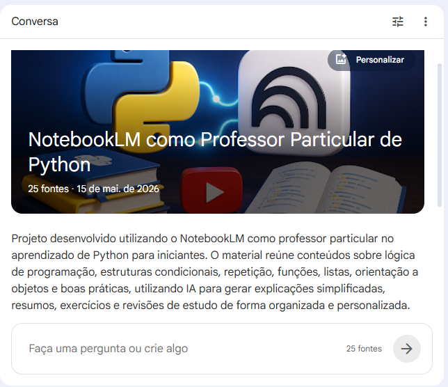

---

# 📖 Descrição do Projeto

Este projeto foi desenvolvido como desafio prático da plataforma DIO com o objetivo de explorar o uso da Inteligência Artificial como ferramenta de aprendizagem ativa utilizando o NotebookLM.

A proposta consiste em utilizar o NotebookLM como um “professor particular” no estudo de Python para iniciantes, auxiliando na compreensão de conceitos fundamentais da linguagem, criação de resumos, esclarecimento de dúvidas, revisão de conteúdos e geração de exemplos práticos.

Além do estudo técnico sobre Python, o projeto também demonstra como a engenharia de prompts pode melhorar significativamente a qualidade das respostas geradas pela IA.

---

# 🎯 Objetivos

* Utilizar o NotebookLM como apoio aos estudos de Python;
* Aplicar técnicas de curadoria de conteúdo;
* Explorar engenharia de prompts;
* Consolidar conceitos fundamentais da linguagem Python;
* Criar um material organizado para futuras revisões;
* Demonstrar o processo de aprendizagem utilizando IA.

---

# 🧠 Conteúdos Estudados

Durante o desenvolvimento do projeto, foram estudados os seguintes conteúdos:

* Variáveis e Tipos de Dados;
* Estruturas Condicionais;
* Estruturas de Repetição;
* Listas e Tuplas;
* Dicionários;
* Funções;
* Modularização;
* Programação Orientada a Objetos (POO);
* Boas Práticas e PEP 8;
* Organização de Estudos com IA.

---

# 📂 Estrutura do Repositório

```bash
📁 notebooklm-professor-python
 ┣ 📄 README.md
 ┣ 📁 imagens
 ┣ 📁 prompts
 ┣ 📁 miniguia
 ┣ 📁 fontes
 ┗ 📄 conclusao.md
```

---

# 📚 Curadoria de Fontes

As seguintes fontes foram utilizadas no NotebookLM para construção do caderno temático:

## 📺 Curso em Vídeo — Python

Fonte:

* Gustavo Guanabara — Curso em Vídeo

Conteúdos utilizados:

* Estruturas condicionais;
* Estruturas de repetição;
* Listas e Tuplas;
* Dicionários;
* Funções;
* Modularização;
* POO.

---

## 📘 The Python Tutorial — Python.org

Documentação oficial utilizada para consultas técnicas e revisão de conceitos.

Fonte:

* https://docs.python.org/3/tutorial/

---

## 📗 W3Schools — Python Tutorial

Material complementar utilizado para consultas rápidas de sintaxe e exemplos.

Fonte:

* https://www.w3schools.com/python/

---

## 📙 PEP 8 — Guia de Estilo Python

Documento oficial contendo boas práticas e padronização de código.

Fonte:

* https://peps.python.org/pep-0008/

---

## 📕 Materiais sobre Programação Orientada a Objetos

Conteúdos utilizados:

* Classes;
* Objetos;
* Métodos;
* Atributos;
* Encapsulamento.

---

# 📸 Evidências do Projeto

## 📌 NotebookLM configurado como professor particular


---

## 📌 Fontes utilizadas no NotebookLM

### Fontes — Parte 1

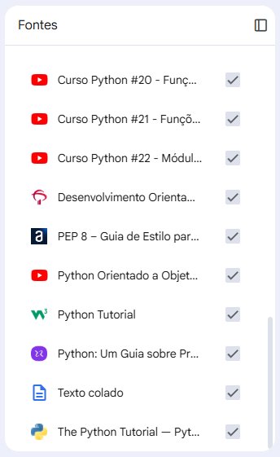

### Fontes — Parte 2

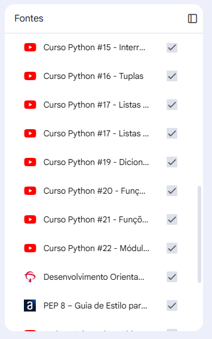

### Fontes — Parte 3

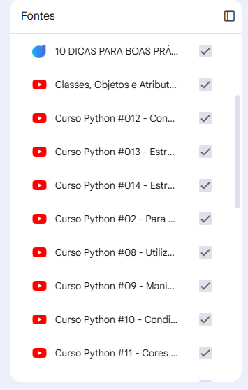

---

## 📌 Mapa mental gerado pela IA

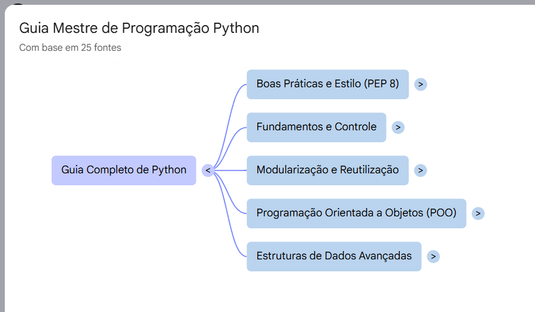

---

## 📌 Explicação sobre funções em Python

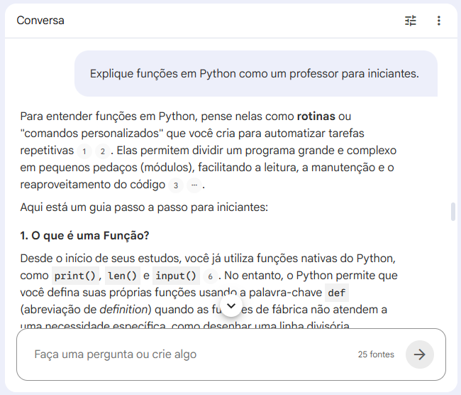

---

## 📌 Explicação sobre listas e tuplas

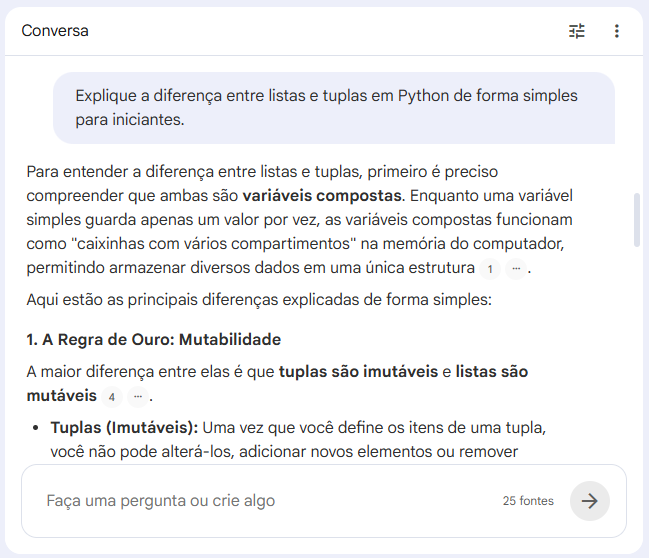

---

## 📌 Exercícios gerados pela IA

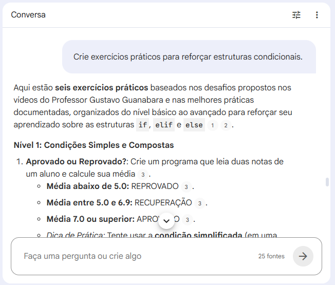

---

## 📌 Guia de estudos gerado automaticamente

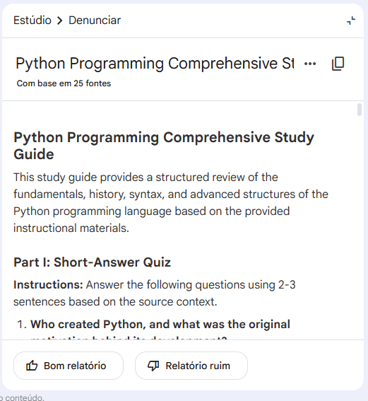

---

## 📌 Slides sobre Programação Orientada a Objetos

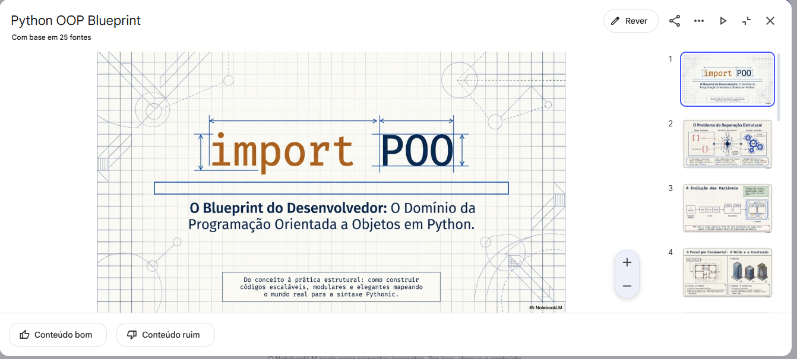

---

## 📌 Trilhas e organização de estudos

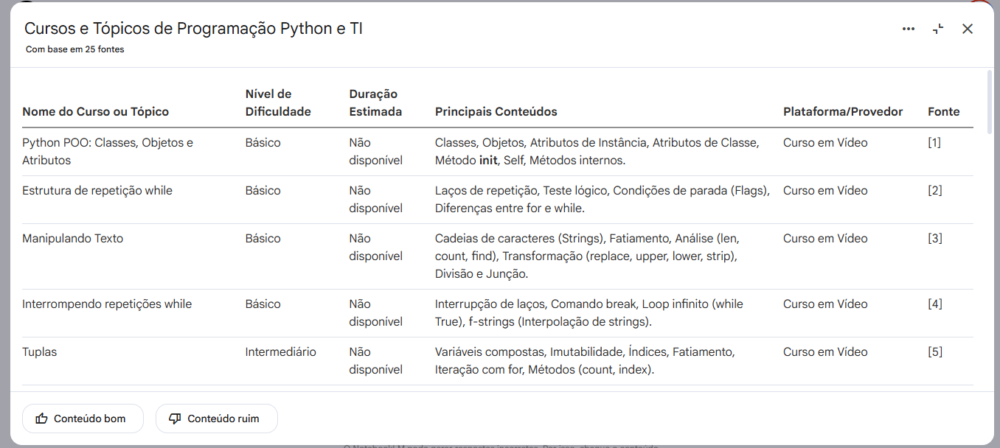

---

# 🛠️ Engenharia de Prompts

Durante o projeto foram realizados diversos testes para entender como obter respostas mais completas, didáticas e contextualizadas utilizando o NotebookLM.

---

## 📌 Prompt 1 — Explicação Didática

```txt
Explique funções em Python como um professor para iniciantes.
```

### ✅ Resultado

O NotebookLM gerou uma explicação passo a passo utilizando linguagem simples e exemplos práticos.

---

## 📌 Prompt 2 — Explicação Simplificada

```txt
Explique a diferença entre listas e tuplas em Python de forma simples para iniciantes.
```

### ✅ Resultado

A IA comparou listas e tuplas utilizando exemplos cotidianos, facilitando o entendimento do conceito de mutabilidade.

---

## 📌 Prompt 3 — Exercícios Práticos

```txt
Crie exercícios práticos para reforçar estruturas condicionais.
```

### ✅ Resultado

Foram gerados exercícios organizados por dificuldade para reforçar o aprendizado.

---

## 📌 Prompt 4 — Organização de Estudos

```txt
Monte uma trilha de estudos de Python para iniciantes.
```

### ✅ Resultado

A IA criou um guia estruturado contendo os principais tópicos da linguagem Python.

---

# ⚠️ Troubleshooting e “Cicatrizes”

Durante o desenvolvimento do projeto, alguns desafios foram encontrados:

---

## 🔸 Respostas muito genéricas

Prompts muito curtos geravam respostas superficiais.

### ✔️ Solução

Adicionar contexto e informar o nível de dificuldade esperado melhorou significativamente os resultados.

---

## 🔸 Linguagem muito técnica

Algumas respostas eram difíceis para iniciantes.

### ✔️ Solução

Solicitar respostas “em linguagem simples” tornou o conteúdo mais didático.

---

## 🔸 Poucos exemplos práticos

Alguns conteúdos eram explicados sem aplicações reais.

### ✔️ Solução

Foi necessário solicitar explicitamente exercícios, exemplos e analogias.

---

# 📘 Miniguia de Estudos — Python para Iniciantes

## 🟢 Variáveis

Variáveis são utilizadas para armazenar informações dentro do programa.

### Exemplo:

```python
nome = "Aracele"
idade = 25
```

---

## 🟢 Estruturas Condicionais

Permitem executar ações diferentes dependendo de uma condição.

### Exemplo:

```python
idade = 18

if idade >= 18:
    print("Maior de idade")
```

---

## 🟢 Estruturas de Repetição

Utilizadas para repetir tarefas automaticamente.

### Exemplo:

```python
for numero in range(5):
    print(numero)
```

---

## 🟢 Funções

Funções permitem reutilizar blocos de código.

### Exemplo:

```python
def saudacao(nome):
    print(f"Olá, {nome}")
```

---

## 🟢 Programação Orientada a Objetos

POO organiza o código utilizando classes e objetos.

### Exemplo:

```python
class Pessoa:
    def __init__(self, nome):
        self.nome = nome
```

---

# 📖 Glossário

| Termo    | Definição                             |
| -------- | ------------------------------------- |
| Variável | Espaço utilizado para armazenar dados |
| Loop     | Estrutura de repetição                |
| Função   | Bloco reutilizável de código          |
| Sintaxe  | Regras da linguagem                   |
| Classe   | Estrutura utilizada na POO            |
| Objeto   | Instância de uma classe               |
| Método   | Função dentro de uma classe           |
| Lista    | Estrutura mutável                     |
| Tupla    | Estrutura imutável                    |

---

# 🔁 Prompts Reutilizáveis

```txt
Explique [conceito] de forma simples para iniciantes.
```

```txt
Crie exercícios práticos sobre [tema].
```

```txt
Resuma [assunto] em formato de revisão rápida.
```

```txt
Explique os erros mais comuns em [tema].
```

```txt
Monte uma trilha de estudos sobre [assunto].
```

---

# 🧠 Aprendizados Obtidos

* Melhor compreensão sobre engenharia de prompts;
* Aprendizado mais organizado utilizando IA;
* Revisão mais eficiente com resumos automáticos;
* Maior facilidade para compreender conceitos complexos de Python;
* Desenvolvimento de pensamento crítico na formulação de perguntas.

---

# 🚀 Conclusão

O desenvolvimento deste projeto permitiu compreender como ferramentas de Inteligência Artificial podem auxiliar no aprendizado de programação de forma prática e personalizada.

A utilização do NotebookLM como professor particular tornou o processo de estudo mais dinâmico, organizado e acessível, além de demonstrar a importância da engenharia de prompts para obtenção de respostas mais completas e eficientes.

O projeto também reforçou conhecimentos fundamentais de Python e mostrou como a IA pode atuar como suporte no processo de aprendizagem contínua.

---

# 👩‍💻 Autor

## Aracele Souza

Projeto desenvolvido para o desafio da DIO utilizando NotebookLM como ferramenta de aprendizagem ativa.
